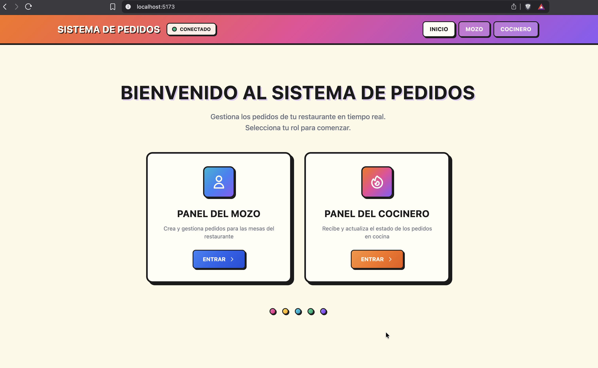
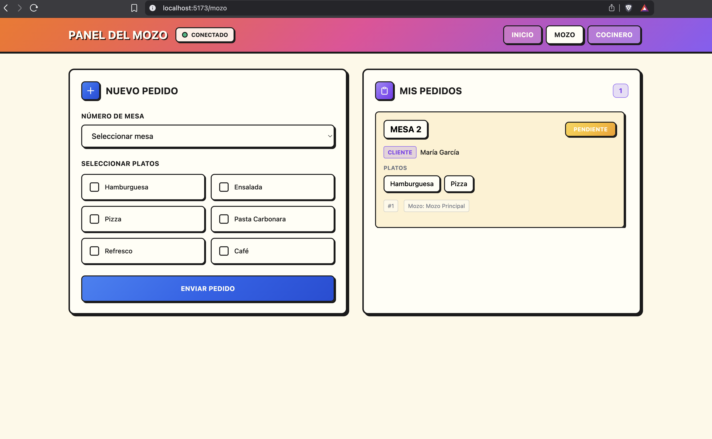
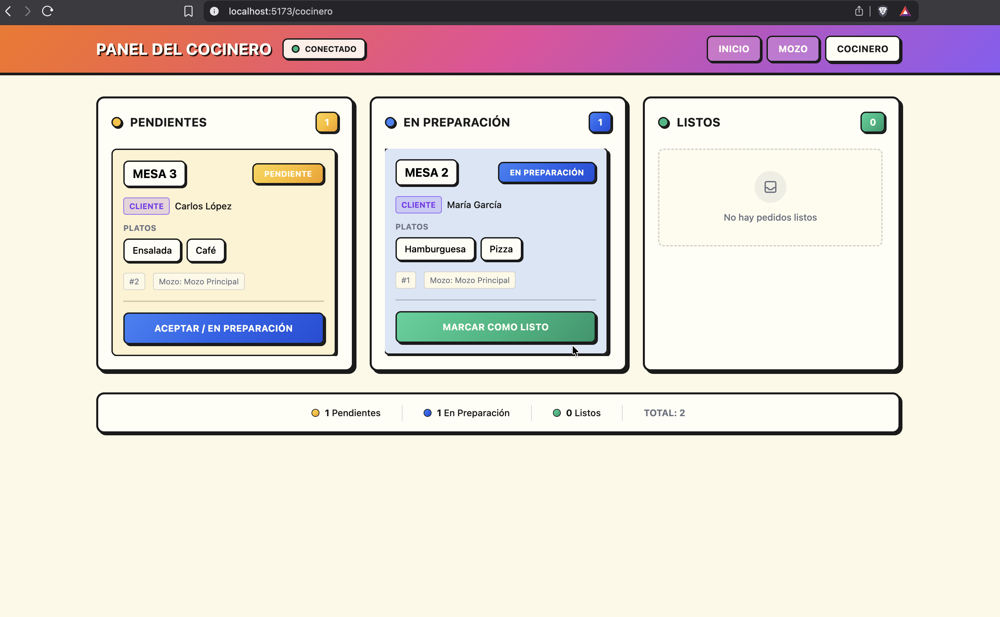

# Kitchen Order Management System



Real-time restaurant order management system where waiters create orders for tables and kitchen staff receives and updates order status in real-time via WebSockets.

## Features

- **Real-time Communication**: Instant order updates between waiter and kitchen panels using Socket.IO
- **Order State Machine**: Track orders through `Pendiente` → `En Preparación` → `Listo para Servir`
- **Dual Interface**: Separate panels for waiters (Mozo) and kitchen staff (Cocinero)
- **REST API**: Full CRUD operations with Swagger documentation
- **Type Safety**: End-to-end TypeScript with Zod validation

## Tech Stack

| Frontend | Backend |
|----------|---------|
| React 18 | Node.js |
| TypeScript | TypeScript |
| Vite | Express 5 |
| Tailwind CSS v4 | Socket.IO |
| React Router v6 | Zod |
| Socket.IO Client | Swagger |

## Getting Started

### Prerequisites

- Node.js 18+
- npm or yarn

### Installation

```bash
# Clone the repository
git clone <repository-url>
cd chat-application-kitchen

# Install backend dependencies
cd backend && npm install

# Install frontend dependencies
cd ../frontend && npm install
```

### Running the Application

**Terminal 1 - Backend:**
```bash
cd backend && npm run dev
```

**Terminal 2 - Frontend:**
```bash
cd frontend && npm run dev
```

Access the application:
- **Frontend**: http://localhost:5173
- **API Documentation**: http://localhost:3006/api-docs

## Architecture

```
Frontend (React SPA) <--Socket.IO--> Backend (TypeScript)
         |                                    |
    localhost:5173                      localhost:3006
```

### Backend Structure

Layered architecture: Routes → Controllers → Services → Repositories

```
backend/src/
├── index.ts                 # Entry point, HTTP + Socket.IO server
├── app.ts                   # Express app setup + Swagger UI
├── config/                  # Environment configuration
├── types/                   # TypeScript interfaces
├── schemas/                 # Zod validation schemas
├── repositories/            # Data access layer (in-memory)
├── services/                # Business logic
├── controllers/             # HTTP request handlers
├── routes/                  # Express routes with Swagger JSDoc
├── sockets/                 # Socket.IO event handlers
├── middlewares/             # Express middlewares
└── swagger/                 # Swagger configuration
```

### Frontend Structure

```
frontend/src/
├── types/                   # TypeScript interfaces
├── hooks/                   # Custom React hooks
├── context/                 # React context providers
├── components/              # Reusable UI components
└── pages/                   # Route pages (Home, Mozo, Cocinero)
```

## API Endpoints

| Method | Endpoint | Description |
|--------|----------|-------------|
| GET | `/api/pedidos` | Get all orders |
| GET | `/api/pedidos/:id` | Get order by ID |
| POST | `/api/pedidos` | Create new order |
| DELETE | `/api/pedidos/:id` | Delete order |
| GET | `/api/mesas` | Get all tables |
| GET | `/health` | Health check |

## Socket Events

| Event | Direction | Purpose |
|-------|-----------|---------|
| `nuevo-pedido` | Client → Server | Create new order |
| `cambiar-estado` | Client → Server | Update order status |
| `pedido-creado` | Server → All | Broadcast new order |
| `estado-actualizado` | Server → All | Broadcast status change |
| `pedidos-iniciales` | Server → Client | Send current orders on connect |

## Screenshots

### Waiter Panel (Mozo)


### Kitchen Panel (Cocinero)


## Configuration

| Variable | Default | Description |
|----------|---------|-------------|
| `PORT` | `3006` | Backend server port |
| Frontend Dev | `5173` | Vite dev server port |

## License

ISC
