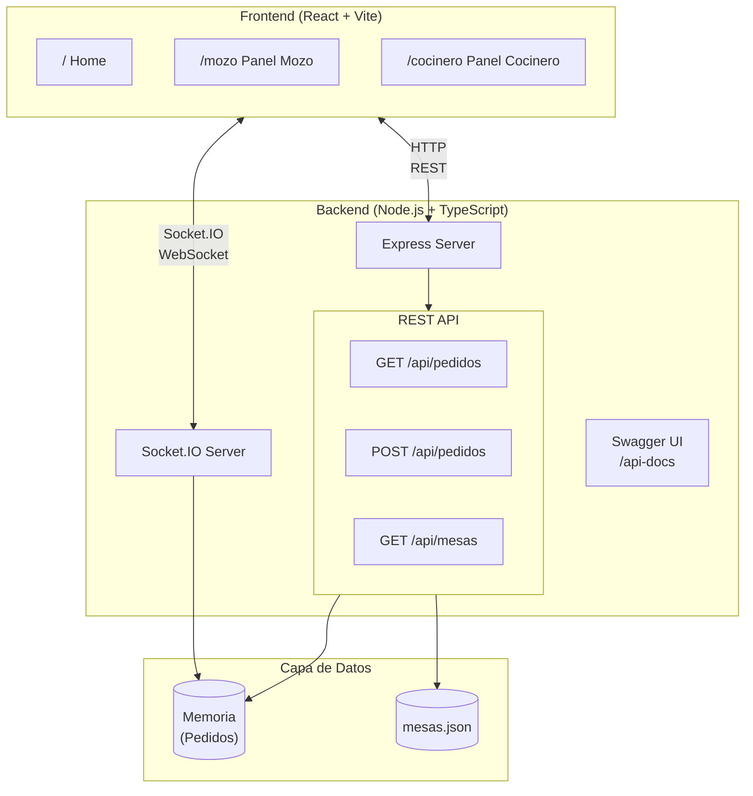
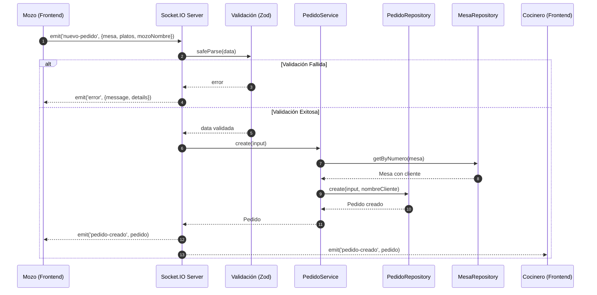
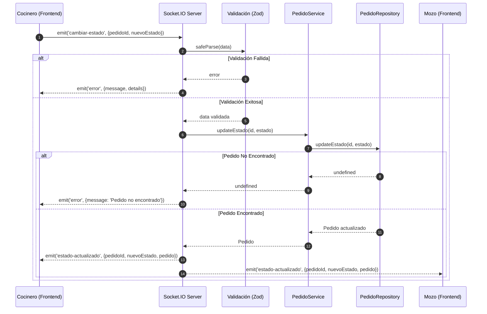
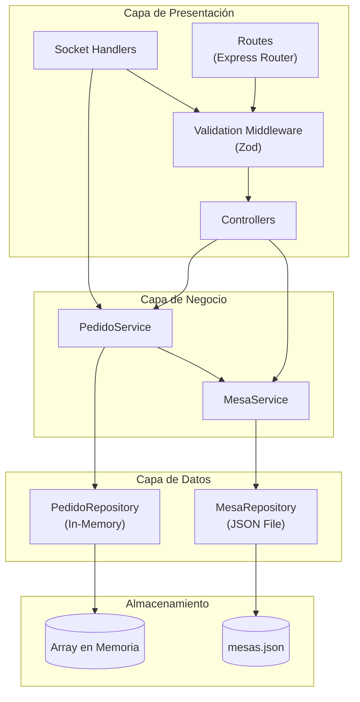
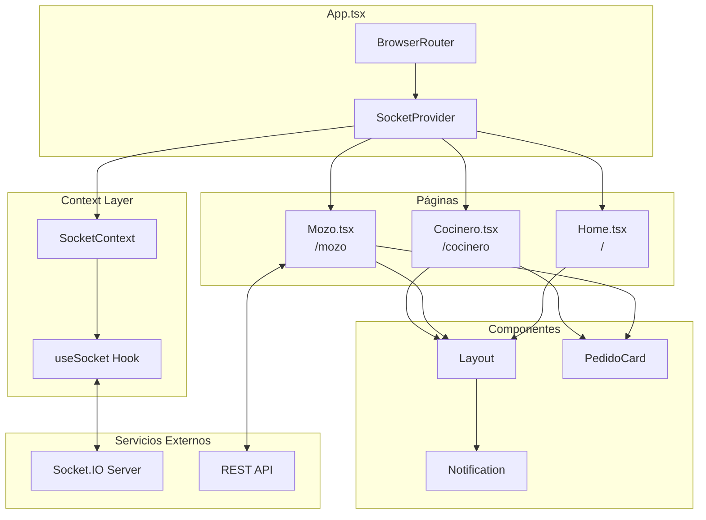
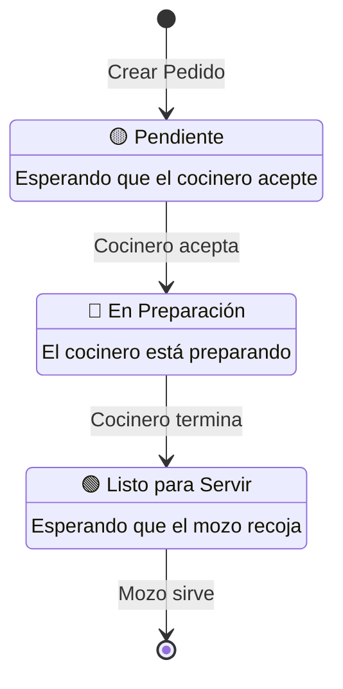
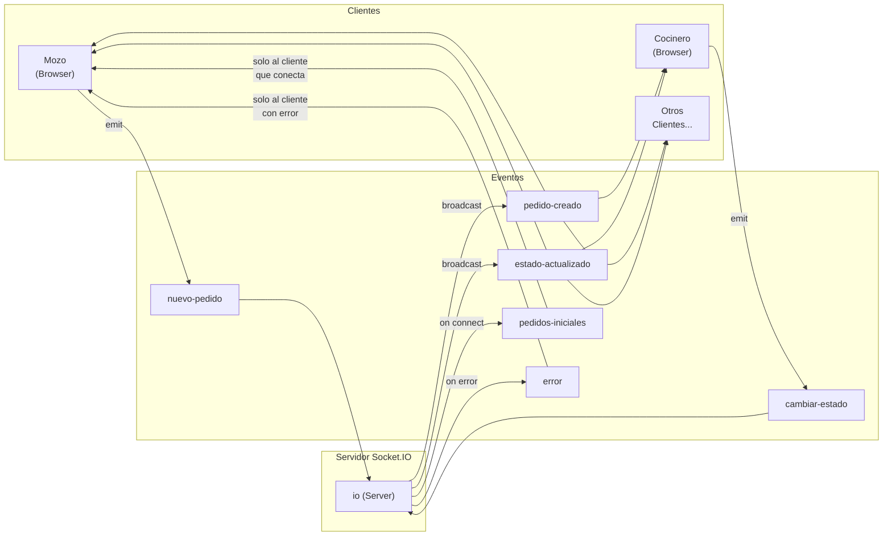
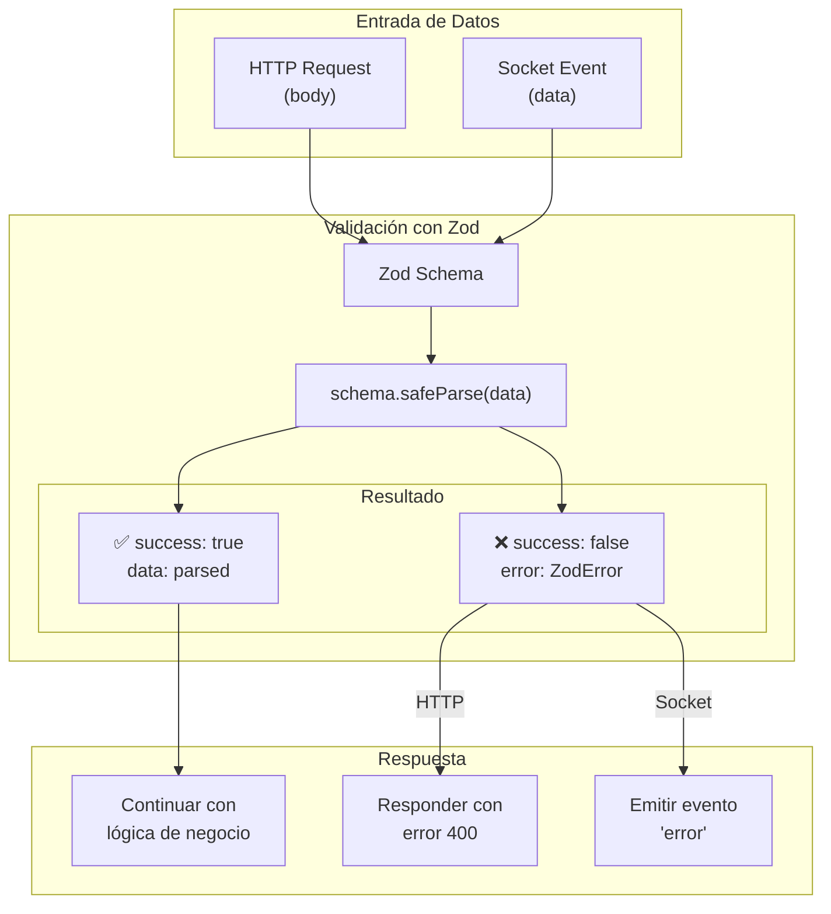
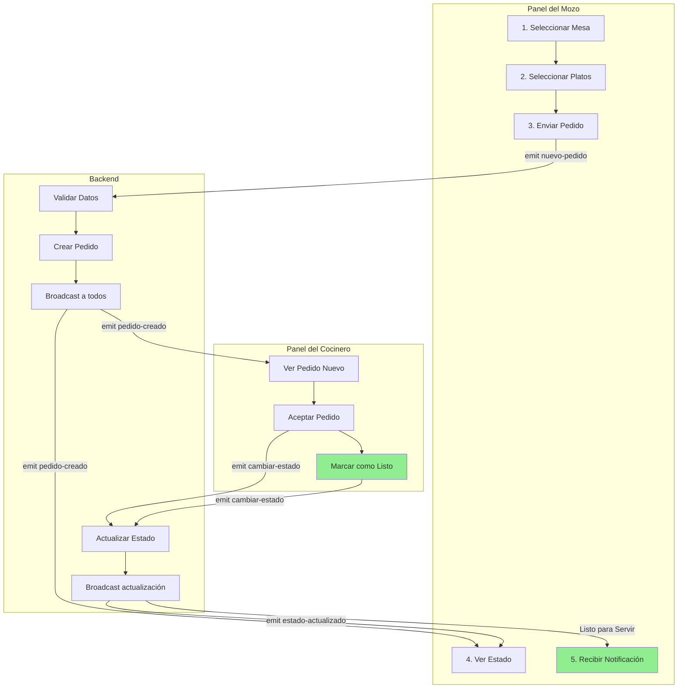
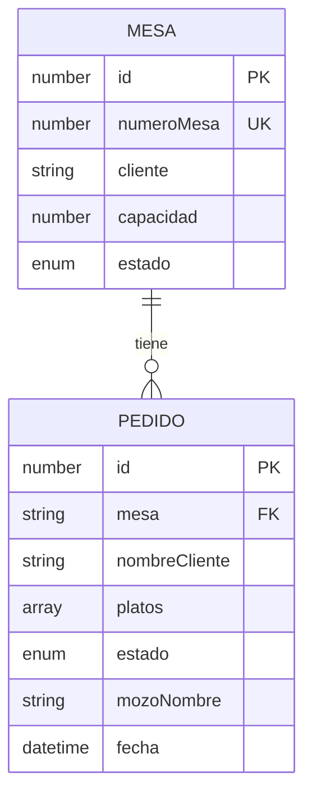

# Diagramas del Sistema

Diagramas Mermaid que explican los flujos y arquitectura del sistema.

## Índice

1. [Arquitectura General](#arquitectura-general)
2. [Flujo de Creación de Pedido](#flujo-de-creación-de-pedido)
3. [Flujo de Cambio de Estado](#flujo-de-cambio-de-estado)
4. [Arquitectura del Backend](#arquitectura-del-backend)
5. [Arquitectura del Frontend](#arquitectura-del-frontend)
6. [Máquina de Estados del Pedido](#máquina-de-estados-del-pedido)
7. [Comunicación Socket.IO](#comunicación-socketio)
8. [Flujo de Validación](#flujo-de-validación)

---

## Arquitectura General

---

## Flujo de Creación de Pedido

---

## Flujo de Cambio de Estado

---

## Arquitectura del Backend

---

## Arquitectura del Frontend

---

## Máquina de Estados del Pedido

---

## Comunicación Socket.IO

---

## Flujo de Validación

---

## Flujo Completo de un Pedido

---

## Estructura de Datos

---

## Cómo Visualizar los Diagramas

### Opción 1: GitHub
GitHub renderiza automáticamente los bloques de código Mermaid en archivos Markdown.

### Opción 2: VS Code
Instala la extensión "Markdown Preview Mermaid Support" o "Mermaid Markdown Syntax Highlighting".

### Opción 3: Mermaid Live Editor
Copia el código Mermaid y pégalo en [mermaid.live](https://mermaid.live)

### Opción 4: Documentación Web
Usa herramientas como Docusaurus, VitePress o MkDocs que soportan Mermaid nativamente.
